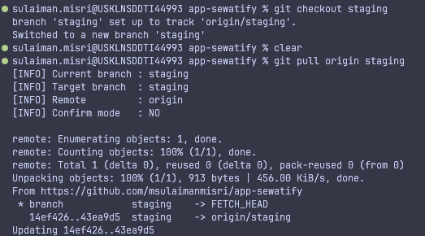
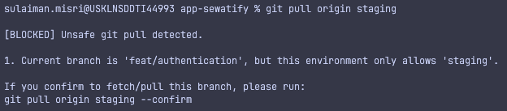

# Git-guard

A lightweight Git safety guard for deployment workflows that blocks unsafe `git pull` commands before they happen.

This project was designed for a branch-controlled deployment flow where code is reviewed and merged into `staging`, then pulled manually on a staging server through the terminal. Git itself allows `git pull <remote> <branch>` to fetch and then integrate the specified branch into the current branch, which means a mistyped pull such as `git pull origin release` while sitting on `staging` can bring in the wrong code. The purpose of `git-guard` is to reduce that operational mistake by intercepting `git pull` and validating the target branch before Git executes.

## Navigation

- [SUPER IMPORTANT NOTICE!](#super-important)
- [Author](#author)
- [Problem it solves](#problem-it-solves)
- [How it works](#how-it-works)
- [Recommended use case](#recommended-use-case)
- [Project structure](#project-structure)
- [Requirements](#requirements)
- [Installation](#installation)
- [Usage](#usage)
- [Configuration](#configuration)
- [How to verify setup](#how-to-verify-setup)
- [Troubleshooting](#troubleshooting)
- [Design notes](#design-notes)
- [Revert or uninstall](#revert-or-uninstall)
- [Future improvements](#future-improvements)

## SUPER IMPORTANT!
This tool is best use in the server where only one branch is allowed to be pulled, such as `staging` on staging server, `release` on release server, and `production` on production server. It is not designed for local development machines where multiple branches are frequently pulled and switched between. Using it in a local environment may lead to frustration due to the extra confirmation steps when pulling different branches.

## Author
Muhamad Sulaiman Misri. Working as a Senior Full Stack Developer in UEM Sunrise berhad. Connect with him on [Github](https://github.com/msulaimanmisri/) or check out his [Website](https://sulaimanmisri.com). You also can email him at [saya@sulaimanmisri.com](mailto:saya@sulaimanmisri.com).

## Problem it solves

In a typical guarded staging workflow, pull commands are usually meant to stay aligned with the branch currently checked out on the server. Git provides script-friendly ways to detect the current branch such as `git branch --show-current`, and `git pull` works as a fetch-then-integrate command, so pulling the wrong branch is both possible and dangerous in deployment environments.

This project prevents mistakes such as:

- Running `git pull origin release` while the repository is currently checked out to `staging`.
- Running `git pull origin production` on a staging environment.
- Pulling a branch different from the branch allowed for that machine or environment.

When such a case is detected, the command is blocked and the user is given an explicit confirmation command with `--confirm` if they intentionally want to continue.

## How it works

`git-guard` does not change Git itself. Instead, it wraps the `git` command at the shell level using a shell function, which is a standard way to override a command and still fall back to the original binary through `command git`.

The wrapper only intercepts `git pull`. All other Git commands such as `git status`, `git log`, and `git branch` are passed directly to the real Git binary unchanged.

The guard script then checks:

- The current checked-out branch.
- The branch being requested by `git pull`.
- The allowed branch for the current environment, defined by `GIT_GUARD_ALLOWED_BRANCH`.
- Whether the user passed `--confirm` to explicitly override the block.

If the command is safe, it proceeds. If not, it stops and shows a clear override command.

## Recommended use case

This tool is best suited for environments where deployments are performed manually through SSH and terminal commands, especially staging or production-adjacent servers where branch discipline matters. It fits well with workflows where pull operations are repetitive and human error is more likely than Git misuse itself.

A typical example:

1. Team creates a PR targeting `staging`.
2. The PR is reviewed, approved, and merged.
3. The deployer SSHs into the staging server.
4. The deployer navigates to the project folder.
5. The deployer runs `git pull origin staging`.

This is exactly the step where `git-guard` helps by blocking accidental pulls from `release` or `production` on the wrong environment.

## Project structure

```text
git-guard/
├── bashrc.env              # Shell wrapper config for Ubuntu / Linux servers
├── zshrc.env               # Shell wrapper config for macOS
├── git-pull-guard.mjs      # The guard script (Node.js)
└── readme.md
```

On macOS, the shell wrapper normally belongs in `~/.zshrc` because zsh is the default shell on modern macOS versions. On Ubuntu or most LAMP/LEMP servers, the wrapper normally belongs in `~/.bashrc`, which is the interactive Bash startup file.

## Requirements

The Node-based version of this guard requires:

- Git
- Node.js
- A shell that supports shell functions, such as zsh or bash.

## Installation

### 1. Create the guard directory

```bash
mkdir -p ~/.git-guard
```

### 2. Create the guard script

Copy `git-pull-guard.mjs` from this repository into `~/.git-guard/git-pull-guard.mjs`. Open the file if you want to review or modify the code before copying:

```bash
open git-pull-guard.mjs
```

### 3. Add the shell wrapper

#### macOS — copy the codes from `zshrc.env` into your `~/.zshrc`

Open `zshrc.env` from this project, copy all the code inside it, and paste it into your `~/.zshrc`:

```bash
open zshrc.env
```

After pasting, reload the shell:

```bash
exec zsh
```

#### Ubuntu / Linux server — copy the codes from `bashrc.env` into your `~/.bashrc`

Open `bashrc.env` from this project, copy all the code inside it, and paste it into your `~/.bashrc`:

```bash
open bashrc.env
```

After pasting, reload the shell:

```bash
source ~/.bashrc
```

## Usage

After setup, continue using Git as usual.

### Allowed command

```bash
git pull origin staging
```

If the current branch is `staging` and the allowed branch is also `staging`, the command proceeds normally.

Image of normal pull output: <br />


### Blocked command

```bash
git pull origin release
```

Example blocked output:

```text
[BLOCKED] Unsafe git pull detected.

1. You are trying to pull 'release', but only 'staging' is allowed here. Your current branch is 'staging'.

If you confirm to fetch/pull this branch, please run:
git pull origin release --confirm
```

Image of blocked pull output: <br />


### Override intentionally

```bash
git pull origin release --confirm
```

Example override output:

```text
[WARNING] Bypassing violations via --confirm:

  1. You are trying to pull 'release', but only 'staging' is allowed here. Your current branch is 'staging'.

[INFO] Current branch : staging
[INFO] Target branch  : release
[INFO] Remote         : origin
[INFO] Confirm mode   : YES
```

This allows an intentional override while logging exactly what was bypassed.

## Configuration

The environment variable below controls which branch is allowed on the current machine:

```bash
export GIT_GUARD_ALLOWED_BRANCH=staging
```

Examples:

| Environment | Allowed branch |
|-------------|----------------|
| Staging server | `staging` |
| Release server | `release` |
| Production server | `production` |

This variable can be set differently per machine, per user, or per environment profile.

## How to verify setup

Check whether the wrapper is active:

```bash
type git
```

The output should indicate that `git` is a shell function when the wrapper is loaded.

To inspect the loaded function in zsh:

```bash
typeset -f git
```

To inspect the first lines of the guard file:

```bash
head -n 5 ~/.git-guard/git-pull-guard.mjs
```

To test the guard script directly with Node:

```bash
node ~/.git-guard/git-pull-guard.mjs origin staging
```

## Troubleshooting

### `import: command not found`

This means the `.mjs` file is being executed by the shell instead of Node. The fix is to make sure the shell wrapper actually calls `node ~/.git-guard/git-pull-guard.mjs "$@"`, and that the current shell session has been reloaded properly.

### Wrapper changes do not take effect

The currently running shell may still be using the old function definition. Reloading the shell with `exec zsh` on macOS or `source ~/.bashrc` on Linux updates the active session.

### `git` is not using the wrapper

Run:

```bash
type git
```

If the output does not show `git` as a shell function, the wrapper is not loaded in the current shell session.

### Detached HEAD errors

The guard intentionally blocks execution if the repository is in detached HEAD state, because branch safety checks depend on knowing the current branch. Git offers script-friendly branch detection through commands such as `git branch --show-current` and `git rev-parse --abbrev-ref HEAD`, which return meaningful values only when a branch context exists.

### Git not installed or not in PATH

The guard checks whether `git` is available before running. If Git is missing:

```text
[ERROR] Git is not installed or not in PATH. Git Guard requires Git to function.
```

Install Git first or add it to your `PATH`.

### Not inside a Git repository

The guard verifies you are inside a Git repository before proceeding. If you run `git pull` outside a repo:

```text
[ERROR] Not inside a Git repository. Please navigate to a git repository and try again.
```

Navigate into a Git repository before running the command.

### Unexpected fatal errors

A top-level `try/catch` wraps the entire script to catch anything unexpected. If something goes wrong:

```text
[FATAL] An unexpected error occurred in Git Guard:
<error message>

If this error persists, try reinstalling Git Guard:
  1. Delete the guard script: rm ~/.git-guard/git-pull-guard.mjs
  2. Recreate it following the installation guide.
```

This gives you a clear path to reset the tool if it ever breaks.

## Design notes

This tool intentionally guards only `git pull`, because that is where the operational risk was identified in the deployment workflow. Git aliases and wrapper techniques can be used to customize command behavior, but wrapping the `git` command at shell level gives tighter control over accidental pull behavior while still preserving the standard Git interface for everyday use.

The implementation is intentionally opinionated:

- Manual terminal-driven deployment workflow.
- Branch-restricted environments.
- Explicit confirmation for unsafe actions.
- Minimal interference with standard Git commands.

## Revert or uninstall

If this tool is no longer needed, it can be removed cleanly because it only changes two things: a shell wrapper in the user's shell startup file and the guard script stored in the home directory. The wrapper works by overriding `git` at shell level, so uninstalling it simply means removing that function and reloading the shell.

### 1. Remove the shell wrapper

On macOS, open `~/.zshrc` and delete the `git()` wrapper plus the `GIT_GUARD_ALLOWED_BRANCH` export if it was added only for this tool. On Ubuntu or other Linux servers, do the same in `~/.bashrc`.

You can reference the `bashrc.env` and `zshrc.env` files in this project to see exactly which lines to remove.

### 2. Reload the shell

After removing the wrapper, reload the current shell so the original Git command is used again. On zsh, restarting the shell with `exec zsh` is a reliable way to refresh the active session, while Bash users can reload their startup file with `source ~/.bashrc`.

```bash
# macOS / zsh
exec zsh

# Ubuntu / bash
source ~/.bashrc
```

### 3. Delete the guard script

Once the wrapper is gone, the script file itself can be removed from the home directory because it is no longer referenced by the shell.

```bash
rm -f ~/.git-guard/git-pull-guard.mjs
rmdir ~/.git-guard 2>/dev/null || true
```

### 4. Verify Git is back to normal

Run the command below to confirm that `git` is no longer a shell function. If uninstall is complete, the output should point back to the normal Git command instead of a shell wrapper.

```bash
type git
```

This restores the previous behavior, meaning `git pull origin <branch>` goes directly to Git again with no guard or confirmation layer in between.

## Future improvements

Possible next steps:

- Guard `git fetch`, `git merge`, and `git checkout` as well.
- Detect environment automatically from folder path or `.env`.
- Add colored terminal output.
- Add per-repository configuration.
- Add logging for blocked commands.