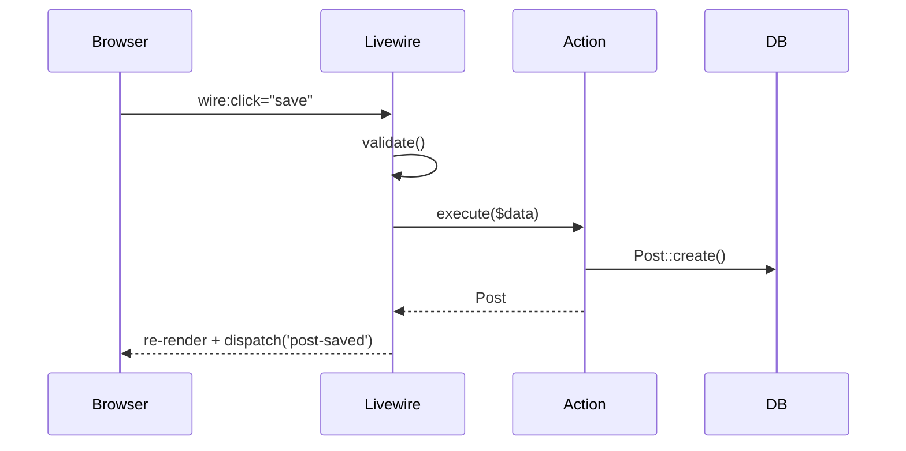
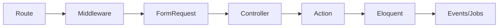

# show-me Laravel Edition

1. Help the user understand the current topic of conversation visually. Skip the preamble and keep prose brief. Pick the smallest view that makes the key point clear.
   
2. Every time you want to explain, create the `html` file. Use TailwindCSS CDN (version 4.x). No inline or internal or external css file. Use only Tailwindcss utility classes.
   
3. When the user points at something, first orient yourself with cheap, fast reads before explaining:

- `php artisan route:list --path=...` — find the route → controller/action wiring
- `php artisan model:show App\\Models\\User` — inspect fillable, casts, relations
- Follow the Laravel flow: HTTP Kernel → middleware → Form Request → Controller/Action → Service/Eloquent → events/jobs → response
- For Livewire: component class in `app/Livewire/` + its Blade view + `wire:*` bindings
- For Alpine: `x-data` scope, `x-on` / `@` listeners, and where `$wire` bridges into Livewire

## Views

- Show logic or an algorithm as pseudocode:

```
on(FormRequest::authorize)
    if user cannot 'update' post
        abort 403
validate input
DB::transaction
    update post
    dispatch PostUpdated
return redirect with flash
```

- Show runtime control flow as a call tree:

```
POST /posts
  HandleController@store
      StorePostRequest::validated
      StorePostAction->execute
          Post::create
          dispatch(new NotifySubscribers(post))   # queued
      redirect()->route('posts.show')
```

- Show structure as a component tree — Blade layout → Livewire components → Alpine islands — including state and boundaries that matter:

```
<x-app-layout>                      (resources/views/layouts/app.blade.php)
  <livewire:posts.index />          (app/Livewire/Posts/Index.php)
      #[Computed] posts()           (cached per request)
      wire:model.live="search"
      <div x-data="{ open: false }">  (Alpine island, no server round-trip)
          <button @click="$wire.delete(postId)">
```

- Show file responsibility or a broad refactor as a shallow file tree:

```
app/
├── Http/Controllers/   # thin: parse request, delegate, respond
├── Actions/            # business logic, one class per use case
├── Livewire/           # full-page + inline components
├── Models/             # Eloquent: relations, casts, scopes
└── Jobs/               # queued side effects (mail, notifications)
resources/views/        # Blade layouts, pages, <x-*> components
```

- Show component interaction, control flow, or data flow with Mermaid:



- Show request lifecycle with Mermaid when the point is the framework, not the app:



- Use ```diff when the point is what changes and the surrounding shape already exists. Match the diff shape to the topic.

For a Blade/Livewire change:

```
 <x-app-layout>
   <livewire:posts.index />
+    <livewire:posts.search-filter />
   <div x-data="{ open: false }">
+    <span x-show="$wire.saving">Saving…</span>
```

For a file-layout change:

```
 app/
 ├── Http/Controllers/PostController.php
+├── Actions/
+│   └── StorePostAction.php    # extracted from controller
 ├── Livewire/
-└── Jobs/SendEmails.php
+└── Jobs/
+    ├── SendEmails.php
+    └── NotifySubscribers.php
```

For a call-tree or lifecycle change:

```
 save
   validate
   StorePostAction->execute
+    SyncPostToSearch          # new listener on PostUpdated
   dispatch PostUpdated
-  NotifySubscribers           # removed, merged into listener
```

For a state or control-flow change:

```
 on(save)
-  Post::create($data)
+  if draft unchanged
+      return cached post
+  DB::transaction(fn () => Post::create($data))
+  Cache::forget("posts:index")
```

- Show the whole block when most of it is new, when omitted context would hide ownership or order, or when the user needs a copyable target shape. Keep it idiomatic Laravel:

```php
final class StorePostAction
{
    public function execute(array $data, User $author): Post
    {
        return DB::transaction(function () use ($data, $author) {
            $post = $author->posts()->create($data);
            PostUpdated::dispatch($post);
            return $post;
        });
    }
}
```

- For a visual UI (a Blade view's layout, a Livewire state machine, an Alpine interaction) or a concept too dense for Mermaid, write one focused HTML file — a diagram, an infographic, or a short slide deck, whichever fits the point. Match the app's styles: pull real colors/spacing from `tailwind.config.js` / the app's CSS, use real labels and data from the code, support desktop and mobile. Then open it for the user:

```
Bash(open path/to/show-me-{description}.html)
```

## Laravel-specific heuristics

- **Eloquent**: when explaining a model, always surface relations, casts, accessors/mutators, and global scopes — they are where hidden behavior lives. Show N+1 risks as a call tree (`posts → each → $post->author` → 1 query per post).
- **Service container**: if a class is resolved via interface, trace the binding in `AppServiceProvider` / `config` before explaining; name the concrete implementation actually used.
- **Events & queues**: distinguish sync vs `ShouldQueue` listeners/jobs — the call tree ends at `dispatch`, the rest happens on the worker. Say so.
- **Livewire**: explain the wire — what triggers a network round-trip (`wire:click`, `wire:model.live`) vs. what stays client-side (Alpine). Lifecycle hooks (`mount`, `hydrate`, `updated*`) belong in the call tree when relevant.
- **Alpine.js**: treat `x-data` as local state; show `$wire` / `Livewire.on()` / `@entangle` as the boundary into Livewire. Never draw Alpine logic as if it hits the server.
- **Blade**: attribute structure to `@extends`/`@section` vs `<x-layout>` components vs Livewire full-page components — users routinely mix them up.
- **Middleware**: when auth/behavior is confusing, show the pipeline order from the route group — order often IS the answer.
- **Config & env**: if behavior differs by environment, point at the `config/*.php` key and the `.env` var feeding it.

## Guidance

Place each visual next to the short text it supports. Keep only the calls, files, props, relations, states, and boundaries needed to answer the user's current question or the options to resolve the current discussion point.

You may use one of these, you may use several, it is unlikely you will use all of them. Use your judgement and don't overwhelm the user.
